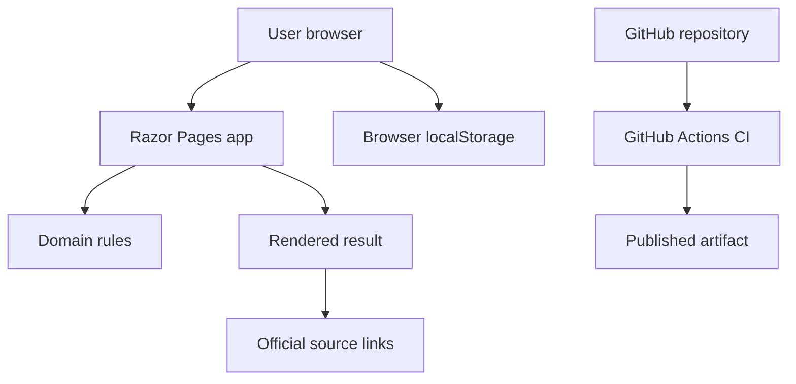

# Threat Model

## Executive Summary

V0.1 is a public ASP.NET Core Razor Pages questionnaire with no accounts, no server-side dossier storage, no file uploads, no database, and no official submission integration. The highest practical risks are integrity of rule output, stale official-source information, availability of the public form, and accidental over-trust by users.

## Scope And Assumptions

In scope:

- `src/SwissEventPermitAssistant.Web`
- `src/SwissEventPermitAssistant.Domain`
- `.github/workflows/ci.yml`
- production release configuration and README/disclaimer content

Out of scope:

- PDF autofill
- egov.fr.ch integration
- authentication
- uploaded documents
- server-side dossier persistence

Assumptions:

- The app may be internet-facing after deployment.
- HTTPS is provided by the hosting platform or reverse proxy.
- V0.1 stores questionnaire drafts only in the user's browser localStorage.
- No sensitive secrets are required at runtime.
- Deployment platform, traffic volume, and monitoring stack are not yet selected.

Open questions that can change risk ranking:

- Which production host will be used?
- Will the deployment be public or restricted during the first pilot?
- Will operational monitoring or uptime alerts be configured by the host?

## System Model

### Primary Components

- Browser UI: Razor Pages and `wwwroot/js/site.js` collect questionnaire answers and save a browser-local draft.
- Web application: ASP.NET Core Razor Pages receives the posted assessment JSON and renders results.
- Domain rules: `EventRulesEvaluator` converts `EventProfile` into actions, documents, confirmations, sources, and deadlines.
- CI: GitHub Actions restores, builds, tests, and publishes the web app.

### Data Flows And Trust Boundaries

- User browser -> Razor Pages over HTTP(S): questionnaire fields and hidden `AssessmentJson`; no authentication; model parsing in `Results.cshtml.cs`.
- Browser localStorage -> Browser UI: draft and last assessment JSON; same-origin browser storage; no server trust is placed in localStorage.
- Razor Pages -> Domain rules in-process: typed `AssessmentInput` mapped to `EventProfile`; domain evaluator has no network or file access.
- Repository -> GitHub Actions: source code and build configuration; CI has read-only repository permission.
- Web app -> Official sources: no runtime fetch; source URLs are displayed as references only.

#### Diagram

## Assets And Security Objectives

- Rule integrity: users should not receive misleading automatic requirements.
- Official-source freshness: stale rules must be visible and must not be silently treated as authoritative.
- User questionnaire answers: low to moderate sensitivity; should remain browser-local in V0.1.
- Availability: public users should be able to complete the questionnaire.
- Build artifact integrity: published output should correspond to tested source.

## Attacker Model

Capabilities:

- Remote unauthenticated user can load pages and submit arbitrary assessment JSON.
- Remote user can send high volumes of requests if the host has no rate limiting.
- User can modify their own localStorage and posted form data.

Non-capabilities:

- No account takeover path exists because V0.1 has no accounts.
- No file parser attack surface exists because V0.1 has no uploads or PDF processing.
- No database extraction path exists because V0.1 has no database.

## Threats And Priority

| Threat | Abuse path | Likelihood | Impact | Priority | Existing mitigations | Recommended next control |
| --- | --- | --- | --- | --- | --- | --- |
| Stale or ambiguous official rules mislead users | User relies on outdated result without confirming with authority | Medium | Medium | Medium | Disclaimer in README/layout; source freshness docs; ambiguous rules marked confirmation | Recheck official sources before public launch and every 90 days |
| Malformed posted JSON causes errors or misleading output | User edits hidden JSON and posts unexpected values | Medium | Low | Low | Server deserializes into typed model; errors redirect to questionnaire | Add integration tests for invalid JSON and oversized payloads if the app becomes public |
| Public form abused for traffic/availability pressure | Unauthenticated user repeatedly requests pages/results | Medium | Low to Medium | Medium | Small stateless app; no database or external calls | Use host-level rate limiting, request size limits, and monitoring |
| Users mistake the app for an official service | UI appears polished and source-forward, but not official | Medium | Medium | Medium | Independent-service footer and README disclaimer | Keep disclaimer visible on landing/results and avoid official logos |
| CI dependency drift | GitHub Actions uses mutable action tags | Low | Medium | Low | CI has read-only contents permission | Pin action SHAs before a higher-stakes deployment |

## Insecure Defaults Check

No hardcoded secrets, API keys, database credentials, default passwords, disabled-auth flags, or weak crypto defaults were found in production-reachable app code.

Notes:

- `AllowedHosts: "*"` is acceptable for common hosted ASP.NET Core deployments when host filtering is provided upstream. If deploying behind a custom reverse proxy, restrict it to the production hostname.
- `IgnoreAntiforgeryToken` is present only on the error page model, not on questionnaire/result submission.
- Browser localStorage is intentionally used for V0.1 draft persistence and should not be treated as trusted server state.

## Manual Review Focus Paths

- `src/SwissEventPermitAssistant.Web/Pages/Results.cshtml.cs`: parses posted assessment JSON and maps it into domain input.
- `src/SwissEventPermitAssistant.Domain/Rules/EventRulesEvaluator.cs`: core rule integrity.
- `src/SwissEventPermitAssistant.Domain/Sources/OfficialSource.cs`: source freshness and traceability.
- `src/SwissEventPermitAssistant.Web/wwwroot/js/site.js`: localStorage, conditional question flow, and hidden result payload.
- `src/SwissEventPermitAssistant.Web/Program.cs`: production middleware, static files, error handling, and health checks.
- `.github/workflows/ci.yml`: build, test, and publish gates.

## Quality Check

- Runtime entry points covered: landing, questionnaire, result post, error page, health check.
- Trust boundaries covered: browser to server, browser storage, server to domain, repository to CI.
- Runtime and CI concerns separated.
- Deployment target remains an explicit open question.
- No high or critical issues identified for V0.1's current no-auth, no-upload, no-database scope.
